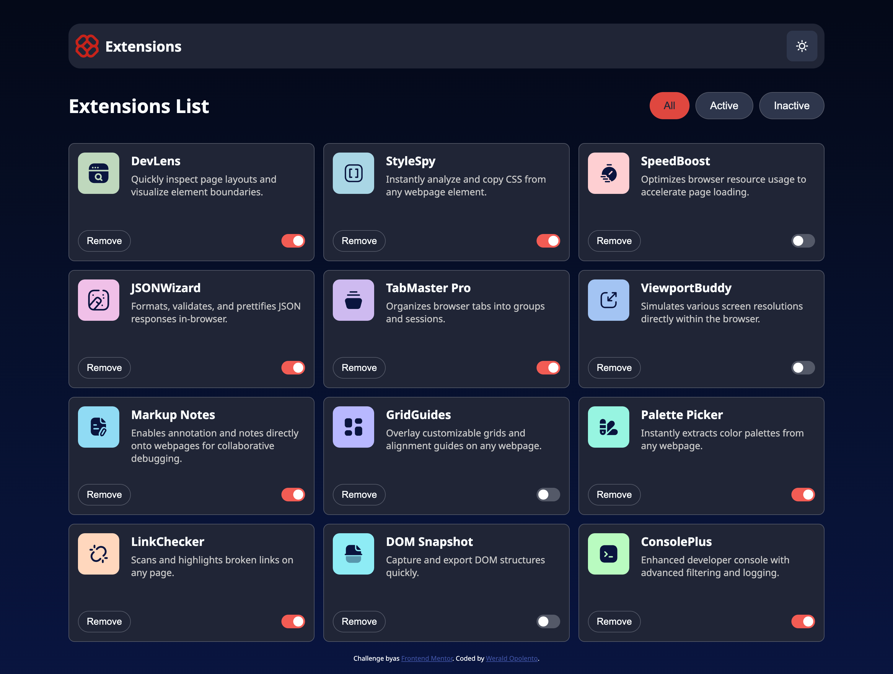

# Frontend Mentor - Browser extensions manager UI solution

This is a solution to the [Browser extensions manager UI challenge on Frontend Mentor](https://www.frontendmentor.io/challenges/browser-extension-manager-ui-yNZnOfsMAp). Frontend Mentor challenges help you improve your coding skills by building realistic projects.

## Table of contents

- [Overview](#overview)
  - [The challenge](#the-challenge)
  - [Screenshot](#screenshot)
  - [Links](#links)
- [My process](#my-process)
  - [Built with](#built-with)
  - [Step by step process](#step-by-step-process)
  - [What I learned](#what-i-learned)
  - [Continued development](#continued-development)
  - [Useful resources](#useful-resources)
- [Author](#author)
- [Acknowledgments](#acknowledgments)

## Overview

### The challenge

Users should be able to:

- Toggle extensions between active and inactive states
- Filter active and inactive extensions
- Remove extensions from the list
- Select their color theme
- View the optimal layout for the interface depending on their device's screen size
- See hover and focus states for all interactive elements on the page

### Screenshot

### Links

- GitHub Repository for Solutions: [GitHub Repository for Solutions](https://github.com/weraldco/fmchallenge-browser-extension-manager)
- Live Site URL: [Live Project](https://weraldco.github.io/fmchallenge-browser-extension-manager/)

## My process

### Built with

- Semantic HTML5
- CSS (Casscading Style Sheet)
- Vanilla Javascript

### Step by step process

- I download the starter files.
- Then open it in vscode.
- First thing I did after I open the starter files is jump immediately to code what is in preview without reading the instruction.
- But while building the site I realize it's not ideal.
- So I start again and read the instructions and style guide.
- I decide to use pure HTML, CSS, and Javascript to challenge myself.
- I first build the semantic HTML5 in index.html file.
- I get the necessary styles in the style guide like font-family, colors, font-size, bg-gradient and screen sizes.
- I start prototyping the preview design in HTML.
- Then add a style inside the styles.css
- I start in mobile view design.
- Then the dekstop view design. One thing I realize 375px is too small so I change it, a little bigger screen.
- After I finish the responsive design I start fetching the data from json file using javascript.
- I code the theme toggle button
- and add a design for dark and light theme.
- Add functionality for remove button.
- Add functionlity for active and inactive state button.
- Add the functionlity for menu, filtering which is active and inactive items.
- After I finish the challenge, I test every functionality.
- I upload it in github and make it live using github page.

### What I learned

While building this Frontend Mentor Challenge, I realize that jumping back to Vanilla CSS and Vanilla Javascript is fun, I practice my vanilla skill. because lately I always build site using React and Tailwind. Going back to basic is not degrading your self, more on refreshing your knowledge for the skill you forget to use. It's like sharpening the other short knife.

### Continued development

While building the remove button, I realize that I can add also a Add item, and update Item. So maybe if I have a free time I can build it, hopefully soon.

### Useful resources

Getting help is not a bad thing, I remember couple years ago, when I need to solve the problem in my code I jump to stackoverflow to find a solution, but today there's an AI like ChatGPT or Gemini that can help you solving the coding problems, but I practice the try to solve by myself and when I feel stuck, I ask ChatGPT for assistance. So don't be shy to use the AI nowadays.

## Author

- Website - [Werald Coronel Opolento](https://wcoop.vercel.app)
- Frontend Mentor - [@weraldco](https://www.frontendmentor.io/profile/weraldco)
- Github - [@weraldco](https://github.com/weraldco)

## Acknowledgments

My two cents to give for the fresh developer and trying to start their journey in building things, try to learn the basic and build your personal project. I just found this Front-end Mentor from the someone whose also practicing Front-end, so I try it and I like it. Keep on practice your skill, don't let your sword get rusted.
